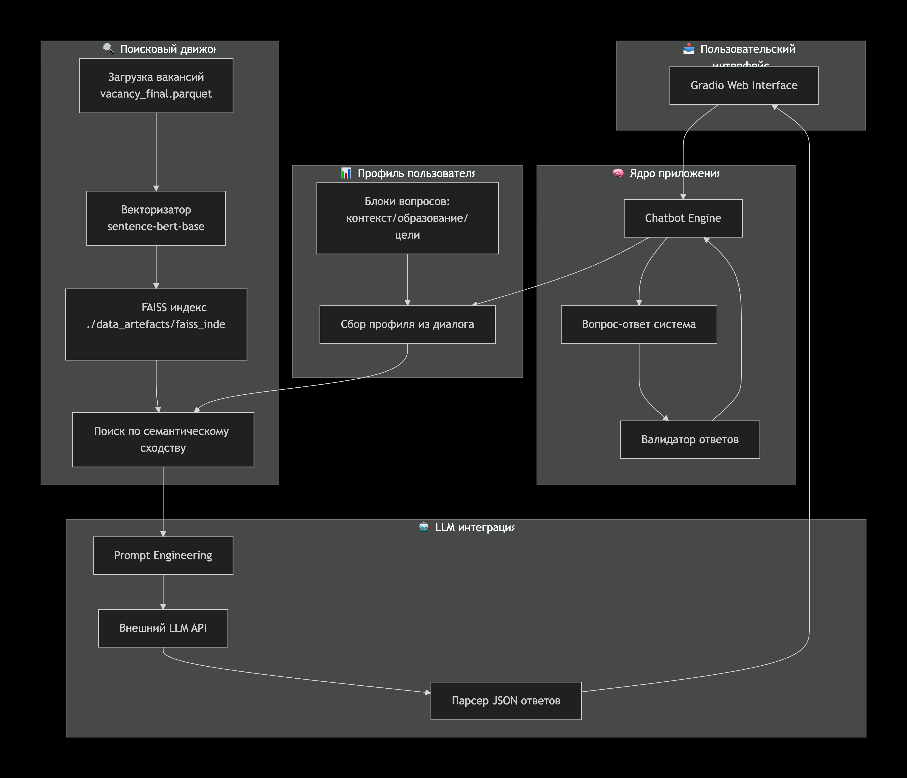

# Карьерный агент

## Описание

career_agents — это интерактивный сервис карьерного коучинга для технических Data Science специалистов, использующий ML/AI для анализа резюме и профиля пользователя и рекомендаций по вакансиям. Это позволяет специалистам эффективнее следить за рынком труда, прокачивать свое резюме и строить карьерный трек по своим целям.

Сценарии PoC:
- анализ резюме (слабые и сильные места, красные флаги для hr и тд)
- рекомендация вакансий, похожие на предыдущий опыт работы
- анализ рынка вакансий спецаильности
- построение персонализированного карьерного трека

PoC не покрывает:
- потребность в поиске вакансий, за этим на сам сайт hh.ru
- резюме парсится исключительно из hh.ru, другие сервисы не предусмотрены
- поддержка специальностей только из Data Science области
- вилки зарплат есть в какой-то степени, но покрытие всего 20-30 % покрытия от всех вакансий, что не позволяет анализировать вилки зарплат


## Быстрый старт

1. **Настройте переменные окружения**  
   Создайте файл `.env` в корне проекта и пропишите:
   ```
    DEEPSEEK_API_TOKEN=""
   ```
   Поменять пути на свои в definitions.py
   ```
   DB_PATH = ""
   INDEX_URL = ""
   ```

2. **Установите зависимости**
   ```sh
   pip install -r requirements.txt
   ```

3. **Запустите Gradio-интерфейс**
   ```sh
   python3 -m ui.app_gradio
   ```
## Данные
Данные представляют собой вакансии из hh.ru, полученные по официальному api, связанные с Data Science. Основные поля, с которыми будет работать llm:

Список ключевых слов для сбора вакансий:

```
   'Computer vision',
   'Data Analyst', 'Data Engineer', 'Data Science', 'Data Scientist', 'ML Engineer',
   'MLOps инженер', 'AI',
   'Product Manager', 'Python Developer', 'Web Analyst', 'Аналитик данных',
   'Бизнес-аналитик', 'Системный аналитик', 'Финансовый аналитик', 'ML',
   'Deep Learning', 'NLP', 'LLM', "Project Manager", 'Product Owner','Time series',
```

- **requirements** - описание требования от соискателя в вакансии
- **responsbility** - описание задач, которые будет выполнять потенциальный работник
- **skills** - теги навыков вакансии (например SQL, Python и тд.)
- **work_format_names** - формат работы: гибрид, офис или удалёнка
- **company** - компания факансии
- **salary** - зарплата в рублях( где-то 30-40% не null)
- **experience** - класс опыта работы ( 0, 1-3, 3-6, 6+ лет)
  
Список ключевых слов для сбора вакансий:

Вакансий около 20 тысяч, в данный момент хранятся в parquet локально([data_artefacts/vacancy_final.parquet](data_artefacts/vacancy_final.parquet))


## Схема взаимодействия



## Пример запуска

```sh
python3 -m ui.app_gradio
```

## Пример запуска бенчмарка

```sh
python3 -m llm_judge.py
```

## Лицензия

Проект распространяется под лицензией Apache 2.0. См. [LICENSE](LICENSE).

## Контакты

Для вопросов и предложений — создайте issue или pull request.
